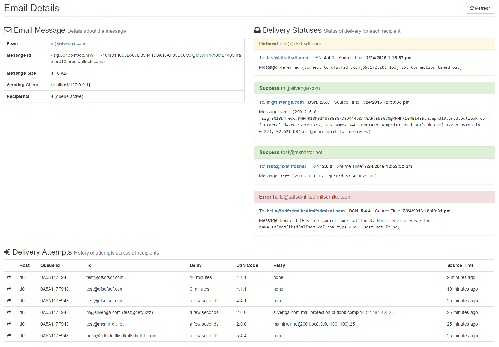

# MailTrace

 

## TODO

- [ ] Handle dup logs
- [X] Preserve log lines when decomposed
- [X] Delimitate on first `=` in each attribute tuple
- [X] Paging is done before the filter join. Page after join to prevent issues. 
- [X] Show org email
- [X] Handle emails with `=` in the address
- [ ] API should host UI
- [ ] Add UI to build process

## Screenshots

